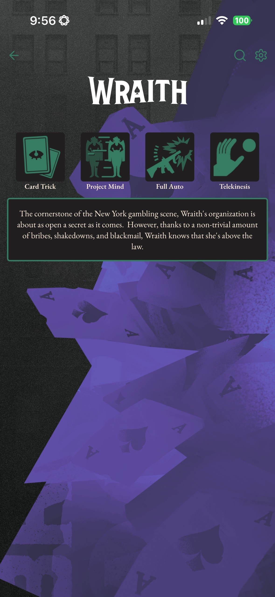
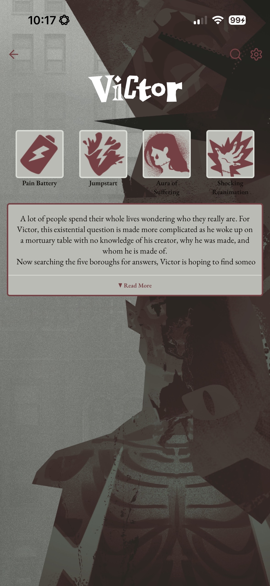

Ddlcktrckr fetches live and historical data from the Deadlock API and visualizes it with smooth animations, GPU-accelerated rendering, and a clean adaptive UI.

Using React Native, Reanimated, RNSkia, TanStack Query, Unistyles, etc.

